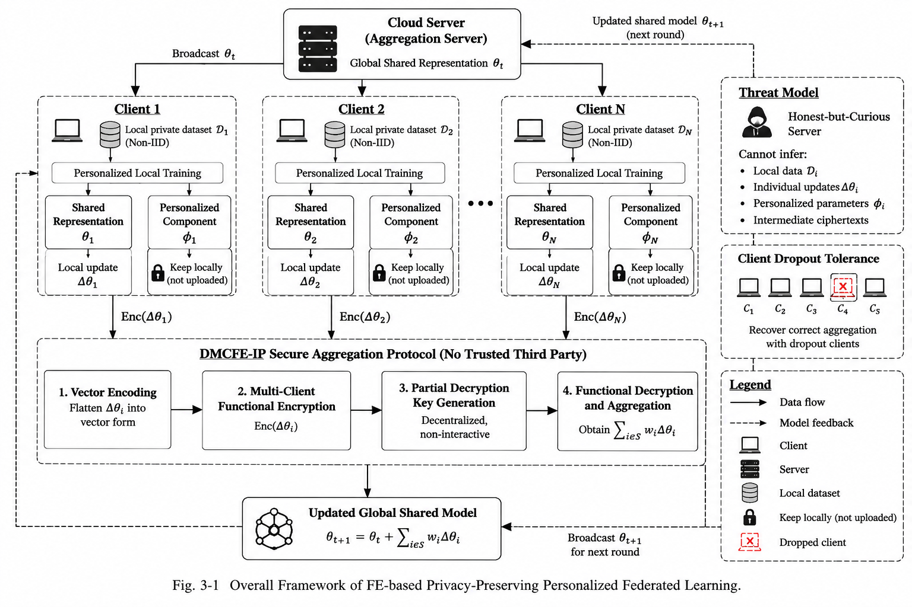

# 第三章 系统设计

## 3.1 系统模型

**图 3-1  面向目标 DMCFE-IP 后端的个性化联邦学习系统架构。** 图中密文上传、部分功能密钥生成与功能解密描述的是目标安全协议。当前高维训练使用的 `chunked_reference` 仅执行定点分块整数加权和，不执行这些密码阶段；其可报告范围见第 3.1.4 节和第 4 章。

### 3.1.1 系统组成

本文考虑由一个协调服务器和 $K$ 个参与方组成的横向联邦学习系统，记客户端集合为
$\mathcal{C}=\{C_1,C_2,\ldots,C_K\}$，协调服务器记为 $S$。客户端持有本地数据，服务器负责
组织通信轮次、下发共享模型以及生成全局聚合结果。原始样本、标签和客户端的个性化模型参数
均不离开客户端。服务器只接收协议规定的聚合消息和训练状态元数据；当接入目标安全后端时，
聚合消息为密文及其辅助信息。

为支持目标 DMCFE-IP 后端的公共参数和身份管理，系统还包含一个可信初始化组件
$\mathsf{TA}$。$\mathsf{TA}$ 负责执行系统初始化、发布公共参数并注册客户端身份，但不保存能够
单独解密客户端更新的集中式主密钥。客户端独立生成并保管自己的密钥材料，服务器所需的功能
密钥由参与客户端针对目标聚合函数生成的部分功能密钥组合得到。$\mathsf{TA}$ 不参与模型训练，
也不接收客户端原始数据；在当前原型中，该角色仅由后端接口抽象表示。

系统中的通信链路采用经过身份认证的安全信道。服务器能够识别参与当前轮次的客户端及其样本
数量。对于满足相应安全定义的目标功能加密后端，服务器从授权函数输出中不能直接获得单个客
户端的模型更新；当前参考后端不提供该机密性保证。客户端之间不交换原始数据，也不要求客户
端保存其他参与方的本地模型状态。

### 3.1.2 数据分布与模型分解

客户端 $C_i$ 的本地数据集表示为

\[
\mathcal{D}_i=\{(x_{ij},y_{ij})\}_{j=1}^{n_i},
\]

其中 $n_i=|\mathcal{D}_i|$ 为客户端样本数。由于不同客户端的采样环境、用户行为或设备条件
可能不同，本文不假设各客户端服从相同的数据分布，而是允许
$P_i(x,y)\neq P_j(x,y)$。该非独立同分布特性是个性化联邦学习的主要动机之一。

模型参数被显式划分为共享表示参数和客户端个性化参数：

\[
\boldsymbol{\theta}_t=
\big(\boldsymbol{\theta}^{s}_t,
\boldsymbol{\theta}^{p}_{1,t},\ldots,
\boldsymbol{\theta}^{p}_{K,t}\big).
\]

其中 $\boldsymbol{\theta}^{s}_t$ 在客户端之间协同学习，
$\boldsymbol{\theta}^{p}_{i,t}$ 仅由客户端 $C_i$ 持有。客户端模型可写为

\[
f_i(x;\boldsymbol{\theta}^{s}_t,\boldsymbol{\theta}^{p}_{i,t}),
\]

对应的本地经验风险为

\[
F_i(\boldsymbol{\theta}^{s},\boldsymbol{\theta}^{p}_{i})
=
\frac{1}{n_i}\sum_{(x,y)\in\mathcal{D}_i}
\ell\!\left(f_i(x;\boldsymbol{\theta}^{s},\boldsymbol{\theta}^{p}_{i}),y\right).
\]

其中 $\ell(\cdot,\cdot)$ 为任务损失函数。与传统 FedAvg 将全部参数进行全局平均不同，本文
只对 $\boldsymbol{\theta}^{s}$ 执行跨客户端聚合，并在每个客户端保留独立的预测头或其他个性化模块。

### 3.1.3 联邦训练流程

训练由通信轮次 $t=0,1,\ldots,T-1$ 构成。第 $t$ 轮服务器根据采样策略选择客户端子集
$\mathcal{A}_t\subseteq\mathcal{C}$，并向其广播当前共享参数 $\boldsymbol{\theta}^{s}_t$。客户端
$C_i\in\mathcal{A}_t$ 首先加载自身保存的个性化参数 $\boldsymbol{\theta}^{p}_{i,t}$，然后在本地
数据上进行分阶段训练：先更新个性化参数，再冻结个性化参数并更新共享表示参数。设本地训练后
得到的共享参数为 $\widetilde{\boldsymbol{\theta}}^{s}_{i,t}$，则客户端上传的共享更新为

\[
\Delta^{s}_{i,t}
=
\widetilde{\boldsymbol{\theta}}^{s}_{i,t}
-
\boldsymbol{\theta}^{s}_t.
\]

客户端不上传 $\boldsymbol{\theta}^{p}_{i,t}$。服务器接收的有效输入仅包含共享更新对应的协议
表示和必要的样本权重。令 $w_{i,t}=n_i$，则第 $t$ 轮的目标聚合量为

\[
\Delta_t^{s}
=
\frac{\sum_{i\in\mathcal{A}_t}w_{i,t}\Delta^{s}_{i,t}}
{\sum_{i\in\mathcal{A}_t}w_{i,t}}.
\]

服务器据此更新共享模型：

\[
\boldsymbol{\theta}^{s}_{t+1}
=
\boldsymbol{\theta}^{s}_t+\Delta_t^{s}.
\]

完成聚合后，客户端在下一轮继续使用自己的个性化参数。因而，同一个共享表示可以与不同
客户端的本地预测头组合，从而适应客户端之间的分布差异。

### 3.1.4 目标 DMCFE-IP 聚合接口与当前原型边界

为避免目标安全后端中的服务器直接获得单个 $\Delta^{s}_{i,t}$，客户端将共享更新转换为向量并
执行定点编码。记 $\operatorname{vec}(\cdot)$ 为按照固定状态字典顺序进行的向量化操作，$B$ 为
坐标裁剪阈值，$q$ 为定点缩放因子，则客户端首先计算

\[
\bar{\boldsymbol{\delta}}_{i,t}[r]
=
\operatorname{clip}\big(
\operatorname{vec}(\Delta^{s}_{i,t})[r],-B,B
\big),
\qquad
\boldsymbol{z}_{i,t}
=
\operatorname{round}\!\left(q\bar{\boldsymbol{\delta}}_{i,t}\right).
\]

设 $\tau_{t,b}$ 为绑定通信轮次、参与者集合、模型版本和分块编号的标签。目标 DMCFE-IP 后端
对第 $b$ 个编码分块的接口可抽象表示为

\[
\boldsymbol{c}^{(b)}_{i,t}
=
\mathsf{Enc}(sk_i,\boldsymbol{z}^{(b)}_{i,t},\tau_{t,b}),
\]

服务器根据样本权重构造线性函数，并通过与该函数绑定的功能密钥获得

\[
\boldsymbol{u}^{(b)}_t
=
\mathsf{Dec}\!\left(
k_{\boldsymbol{w}_t},
\{\boldsymbol{c}^{(b)}_{i,t}\}_{i\in\mathcal{A}_t},
\tau_{t,b}
\right)
=
\sum_{i\in\mathcal{A}_t}w_{i,t}\boldsymbol{z}^{(b)}_{i,t}.
\]

该式将向量输出视为逐坐标或按安全打包规则重复执行线性功能的抽象；具体构造的密文打包、
功能密钥生成和安全参数见第 3.2 节，不能由该接口本身推出。

将全部分块按原顺序连接后得到 $\boldsymbol{u}_t$。服务器对其执行反量化和加权归一化：

\[
\widehat{\Delta}^{s}_t
=
\operatorname{unvec}\!\left(
\frac{\boldsymbol{u}_t}
{q\sum_{i\in\mathcal{A}_t}w_{i,t}}
\right),
\]

并将其用于共享模型更新。整数缓冲区只有在各客户端取值一致时才被复制，不参与浮点定点编码。

当前高维训练配置中的 `chunked_reference` 是非安全参考后端：它以相同的定点输入、样本权重
和分块顺序计算整数加权和，但不调用 $\mathsf{Enc}$、功能密钥生成或 $\mathsf{Dec}$。因此，该
原型可验证参数流向、定点误差、签名校验接口和参考聚合行为；单客户端更新机密性、密码计算
开销和生产级掉线恢复仍需由经过审查的 DMCFE-IP 后端及其独立实验支持。

为防止样本权重被篡改，客户端可以对通信轮次、参与者集合、客户端标识和 $w_{i,t}$ 进行
签名，服务器在请求或组合目标功能密钥前验证签名。若部分客户端在密文上传或恢复阶段掉线，
目标协议根据预设恢复阈值 $\rho$ 使用在线客户端集合完成协议恢复；当在线客户端数小于 $\rho$
时，该轮聚合应中止，而不是生成不完整的共享更新。

### 3.1.5 威胁模型与安全目标

本文采用诚实但好奇的服务器模型：服务器遵循训练流程和协议格式，但可能保存收到的聚合消息、
样本权重、参与者集合及历轮聚合结果，并尝试反推出某个客户端的训练数据或独立模型更新。客
户端默认按照协议执行本地训练，但允许出现通信掉线。本文不将恶意客户端、密钥管理组件与服
务器串谋、模型后门和形式化差分隐私保证纳入当前系统模型；这些问题需要独立的攻击模型和实
验设计。

在上述假设下，目标安全系统追求以下目标：

1. **数据留存性。** 原始训练样本和标签始终保留在本地，服务器只能获得协议所需的消息。
2. **更新机密性。** 在功能密钥只授权聚合函数的前提下，服务器获得加密共享更新的聚合值，
   而不是任一客户端的独立更新。
3. **个性化隔离。** 个性化参数 $\boldsymbol{\theta}^{p}_{i,t}$ 不进入服务器聚合，客户端之间
   不共享该参数。
4. **聚合完整性。** 轮次标签、参与者集合和签名权重共同约束功能密钥的使用范围，降低重放
   或篡改样本权重的风险。
5. **掉线可用性。** 在在线客户端数达到恢复阈值时，协议能够恢复目标加权聚合；不足阈值时
   明确报告失败原因。

当前仓库中的 `chunked_reference` 和 `toy_mcfe` 后端用于验证向量化、定点误差、签名校验
和掉线恢复等协议行为，并不等价于经过安全审计的生产级功能加密方案。因此，本节给出的是目
标系统的抽象模型；关于机密性和安全级别的最终结论必须以替换后的生产级 DMCFE-IP 后端及其
形式化安全分析为依据。

