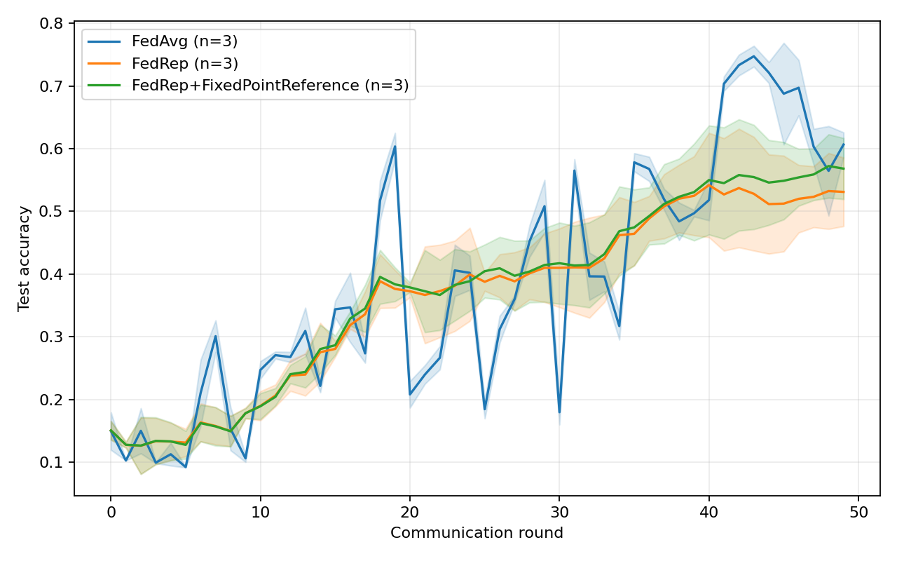
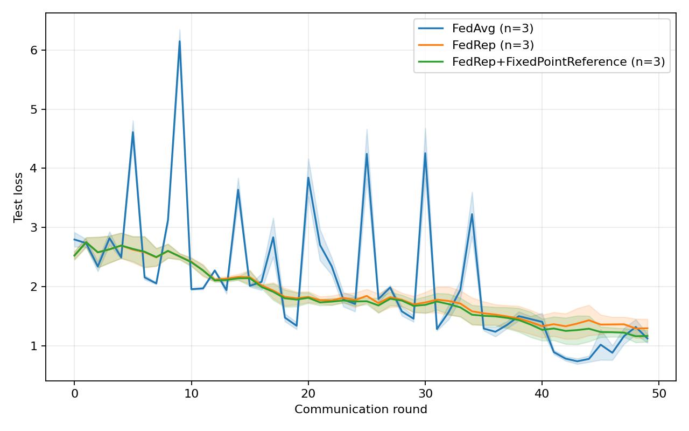

# 第四章 实验与结果分析

## 4.2 实验结果与分析

本节从正式模型对比、定点聚合误差和独立协议恢复三个方面分析实验结果。正式对比已完成 FedAvg、FedRep 与 FedRep+定点参考聚合三个方法在随机种子 0、1、2 下各 50 轮运行。另有早期 FedAvg 数值回归记录和独立掉线恢复验证结果，两者分别用于检查数值一致性与协议控制逻辑，不并入正式模型性能比较。定点参考聚合使用 `chunked_reference` 配置，不执行加密、功能密钥生成或解密；本节不将其称作已实现的安全 DMCFE-IP 方法。

### 4.2.1 结果筛选与有效性说明

正式对比由统一运行脚本写入 `results/comparison_formal_50r/`。任务清单包含 9 个成功完成的运行，每个运行覆盖第 0 至第 49 轮；合并 CSV 共 450 个唯一的“运行编号—通信轮”记录，并保存 9 份配置与 9 份环境快照。全部运行在相同轮次使用相同的客户端集合。测试指标对具有本地测试集的客户端按样本数汇总；图中的每轮均值和样本标准差由三个种子计算。统计比较以种子而非通信轮为重复单位，不把同一次训练的 50 个评价点当作 50 次独立实验；三个种子的离散度也不反映不同客户端抽样序列的影响。

早期实验记录器在部分运行中为同一通信轮写入完全相同的两条评价记录。`fedavg_baseline.csv` 有 40 行，对应第 0 至第 19 轮各两条相同记录；`dmcfe_fedavg.csv` 有 46 行，其中开头 40 行为相同轮次的完整 20 轮片段，末尾 6 行是后来追加的第 0 至第 2 轮片段，数值略有不同。表 4-7 先截取两文件开头的完整 20 轮片段，再在各片段内按通信轮和全部指标去重，各得到 20 个评价点。追加的 3 轮片段不参与比较，也不能把这 20 轮当作独立重复。早期 FedRep+定点参考聚合的单次 50 轮记录仅在第 0 轮和第 49 轮测试，其 78.5104% 终点准确率也不与正式矩阵合并。

早期 FedAvg 轨迹缺少逐次运行的完整配置快照，故表 4-7 保留为独立的聚合回归证据。正式对比的每条结果与方法、种子、配置哈希及同一矩阵编号对应；以下表 4-8 和图 4-1、图 4-2 仅使用正式矩阵，避免混用实验设置不同的记录。

### 4.2.2 定点聚合的数值一致性

为检验定点编码与加权聚合是否明显改变训练结果，本组实验比较相同轮次下的 FedAvg 明文聚合轨迹与定点参考 FedAvg 轨迹。表 4-7 给出了去重后的 20 轮描述性结果。

**表 4-7  FedAvg 与定点参考 FedAvg 的数值差异**

| 指标 | 结果 |
| --- | ---: |
| 第 19 轮 FedAvg 测试准确率 | 65.6763% |
| 第 19 轮定点参考 FedAvg 测试准确率 | 65.6763% |
| 第 19 轮测试准确率绝对差 | 0 |
| 第 19 轮测试损失绝对差 | $2.3256\times10^{-6}$ |
| 20 轮测试准确率最大绝对差 | 0.0543 个百分点 |
| 20 轮测试准确率平均绝对差 | 0.0115 个百分点 |
| 20 轮测试损失最大绝对差 | $1.3890\times10^{-5}$ |
| 坐标级聚合最大绝对误差的最大值 | $3.0214\times10^{-5}$ |
| 聚合平均绝对误差的最大值 | $1.3163\times10^{-5}$ |

两条轨迹在第 19 轮得到相同的测试准确率，最终测试损失仅相差 $2.3256\times10^{-6}$。在全部 20 个评价点中，测试准确率的最大绝对差为 0.0543 个百分点，平均绝对差为 0.0115 个百分点。对应的测试损失最大差异为 $1.3890\times10^{-5}$。这些差异与聚合器记录的 $10^{-5}$ 量级定点误差一致，说明在当前缩放因子和裁剪阈值下，定点舍入没有造成可观察的训练轨迹偏移。

该结果只支持当前配置下的数值一致性。`chunked_reference` 后端直接计算分块整数加权和，不执行生产级 DMCFE-IP 密文运算。因此，表 4-7 不能证明功能加密方案的密码安全性，也不能替代不同缩放因子、裁剪阈值和客户端数量下的误差消融实验。

### 4.2.3 三方法正式对比

表 4-8 汇总三个方法在第 49 轮的测试指标。每个方法均使用种子 0、1、2 分别运行 50 轮，每轮抽取 3 个客户端。表内“均值 ± 标准差”以三个种子为单位计算，准确率差值先在同种子下相减，再求均值和样本标准差。

**表 4-8  正式对比的第 49 轮测试结果（3 个种子；均值 ± 样本标准差）**

| 方法 | 聚合后端 | 测试准确率 | 测试损失 | 相对 FedAvg 的配对准确率差（百分点） |
| --- | --- | ---: | ---: | ---: |
| FedAvg | 明文 | 60.6521% ± 1.9334 个百分点 | $1.1238\pm0.0741$ | — |
| FedRep | 明文 | 53.1090% ± 5.4689 个百分点 | $1.2960\pm0.1549$ | $-7.5431\pm6.4379$ |
| FedRep+定点参考聚合 | `chunked-reference` | 56.8173% ± 4.8684 个百分点 | $1.1661\pm0.0991$ | $-3.8348\pm4.8187$ |

在这三个种子的第 49 轮，FedAvg 的平均测试准确率高于另外两种已运行方法。FedRep+定点参考聚合相对明文 FedRep 的同种子准确率差依次为 $7.2717$、$2.4284$ 和 $1.4245$ 个百分点，但该观察不能归因于定点编码本身，也不能解释为隐私保护带来的精度收益。三个种子仅支持本次配置下的描述性比较；本节不进行显著性检验或推广性方法排名。

**图 4-1  三方法的逐轮测试准确率。** 实线为三个种子的逐轮均值，浅色区域为均值上下一个样本标准差；横轴为第 0 至第 49 轮。图中波动属于同一次训练的连续观测，不增加独立重复次数。

**图 4-2  三方法的逐轮测试损失。** 实线和浅色区域与图 4-1 使用相同的三个种子及汇总方式。两图均来自正式矩阵的 450 条逐轮记录，不混入早期的单次运行。

在参考方法的 150 条逐轮记录中，后端均标记为 `chunked-reference`、`backend_secure=False`，裁剪比例均为 0；共享表示的坐标级最大绝对聚合误差不超过 $3.0482\times10^{-5}$。其样本权重签名完成验证，但恢复门限、恢复误差和协议掉线字段均为空。这些诊断支持当前参数下的定点数值近似，不能证明高维训练执行了加密或掉线恢复。

### 4.2.4 权重签名与掉线恢复结果

掉线恢复采用独立的小规模协议路径验证。该实验选择客户端集合 $\{10,11,12,13\}$，样本权重依次为 $\{2,3,4,5\}$。客户端 13 在密文上传前掉线，客户端 12 在恢复响应前掉线。密文上传集合因此为 $\{10,11,12\}$，恢复响应集合为 $\{10,11\}$。表 4-9 汇总了阈值满足和阈值不足两种情况。

**表 4-9  掉线恢复协议验证结果**

| 场景 | 密文上传客户端数 | 恢复响应数 | 阈值 | 协议结果 | 整数聚合最大误差 |
| --- | ---: | ---: | ---: | --- | ---: |
| 早期掉线 1 个、晚期掉线 1 个 | 3 | 2 | 2 | 成功恢复 | 0 |
| 早期掉线 1 个、晚期掉线 2 个 | 3 | 1 | 2 | 按预期中止 | 不适用 |

当两个客户端提交恢复响应时，协议重构早期掉线客户端的成对掩码材料和晚期掉线客户端的自掩码材料，恢复出的加权整数向量与明文计算完全一致，最大误差和平均误差均为 0。当恢复响应数降至 1 时，可用份额少于阈值 2，协议在解密前中止，没有输出不满足恢复条件的聚合结果。该行为说明实现遵循“份额达到阈值才恢复”的控制规则。

这组实验验证的是构造场景下的协议执行逻辑，而不是任意客户端规模和掉线分布下的可用性结论。高维 `optimized` 聚合与完整掉线恢复仍属于两条独立验证路径，现有结果也没有覆盖服务器与客户端串谋。因此，掉线实验不能直接证明组合系统具备生产级容错能力或形式化抗串谋安全性。

### 4.2.5 研究问题回顾与结果边界

结合第 4.1 节提出的研究问题，当前实验可以得到以下阶段性判断。

1. 对于 RQ1，三方法、三种子正式对比已经完成。在第 49 轮，FedAvg、FedRep 和 FedRep+定点参考聚合的平均测试准确率分别为 60.6521%、53.1090% 和 56.8173%；该结果不支持本次配置下 FedRep 或参考方法具有终点准确率优势。三个种子不足以给出普遍优劣或显著性判断。
2. 对于 RQ2，早期 20 轮配对轨迹用于数值回归；正式参考方法的 150 条记录在无裁剪条件下将坐标级最大绝对聚合误差控制在 $3.0482\times10^{-5}$ 以内。这支持当前参数下定点参考聚合接近明文加权平均，但不能把不同训练轨迹的准确率差异归因于该误差。
3. 对于 RQ3，独立协议验证成功处理了一个早期掉线和一个晚期掉线，并在恢复份额不足时中止。该结果支持所构造场景下的阈值恢复正确性，但不代表完整高维训练路径已经集成掉线恢复。
4. 对于 RQ4，当前 CSV 没有记录各密码阶段耗时、峰值内存和序列化通信字节数，且高维后端不执行真实加密，因此现阶段不能给出功能加密计算与通信开销结论。

综上，当前实验已完成三条可执行训练路径的统一多种子比较，并分别验证了定点数值近似、权重签名与独立阈值恢复路径。目标 DMCFE-IP 密码后端尚未纳入正式训练矩阵，因而本文不把参考方法写作安全聚合性能结果，也不从参考后端时间推断密码计算或通信开销。若要回答完整安全系统的效率问题，还需接入真实后端并采集各密码阶段的时间、内存和序列化字节数。
