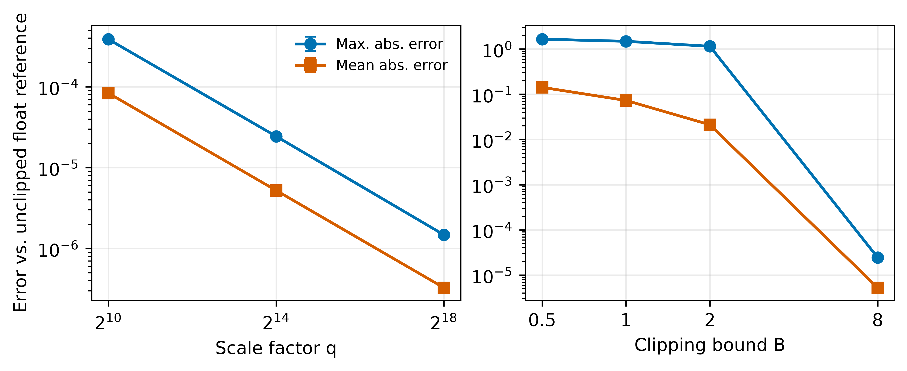
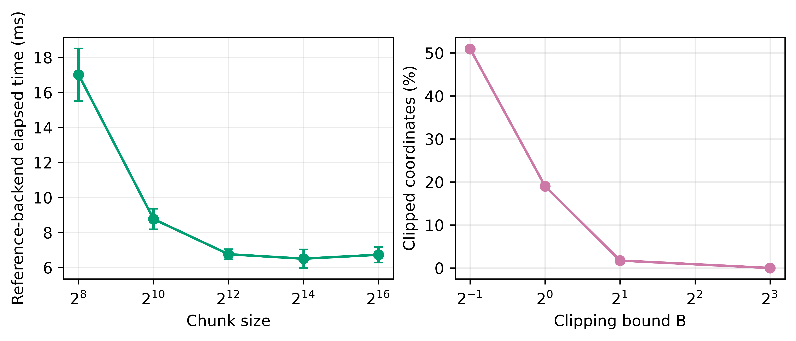

# 第四章 实验与结果分析
## 4.3 参数敏感性与参考后端计算开销分析

本节补充考察定点聚合中缩放因子 $q$、坐标裁剪阈值 $B$ 与分块长度 $L$ 的影响。分析对象是 `OptimizedDMCFEIPAggregator` 的 `chunked-reference` 后端：它在 CPU 上对量化后的 `int64` 向量执行分块样本加权和，接口形状与加权内积聚合一致，但 `is_secure=False`，不执行加密、功能密钥生成或解密。因此，本节将其计时严格称为“参考后端本地聚合耗时”，只用于解释定点编码和分块循环的参数敏感性；不将其解释为 DMCFE-IP 的密码计算、端到端延迟、通信开销或生产部署效率。

### 4.3.1 消融协议与统计范围

为使参数效应可重复且不受训练轨迹、网络传输和 GPU 调度混杂，本节构造 8 个客户端、每客户端 32,768 个坐标的确定性浮点更新。每个种子下客户端权重固定为 $\{32,39,46,53,60,67,74,81\}$；更新由固定种子生成的高斯主体和确定性稀疏离群坐标构成，用于同时触发量化与裁剪路径。实验遍历

\[
q\in\{2^{10},2^{14},2^{18}\},\quad
B\in\{0.5,1,2,8\},\quad
L\in\{256,1024,4096,16384,65536\}.
\]

5 个种子（0--4）下共得到 $3\times4\times5\times5=300$ 条聚合记录。每条记录保存最大绝对误差、平均绝对误差、裁剪坐标比例和 7 次预热后调用的耗时中位数。该微基准在 Windows 11 主机上使用 Python 3.12.14、PyTorch 2.14.0+cpu 和 8 个 PyTorch CPU 线程运行；它与第 4.1 节的 GPU 训练环境不同，故两者的时间数值不作横向比较。误差参考定义为同一原始更新的**未裁剪浮点样本加权平均**，故它同时包含裁剪偏差和定点舍入误差；不能把两者混为纯量化误差。表 4-10 的单因素比较均固定另外两个参数为训练主配置 $q=2^{14}$、$B=8$、$L=65536$。表中“均值 ± 标准差”来自 5 个种子级聚合结果；由于种子数仅为 5，且时间值来自同进程微基准，本节不进行正态性检验、显著性检验或参数优劣排序。

**表 4-10  定点精度与裁剪敏感性（5 个种子；其余参数固定为 $q=2^{14}$、$B=8$、$L=65536$）**

| 变化参数 | 取值 | 最大绝对误差 | 平均绝对误差 | 裁剪比例 |
| --- | ---: | ---: | ---: | ---: |
| $q$ | 1,024 | $3.870\times10^{-4}\pm1.653\times10^{-5}$ | $8.349\times10^{-5}\pm1.826\times10^{-7}$ | $0.000\pm0.000$ |
| $q$ | 16,384 | $2.440\times10^{-5}\pm8.325\times10^{-7}$ | $5.220\times10^{-6}\pm1.398\times10^{-8}$ | $0.000\pm0.000$ |
| $q$ | 262,144 | $1.475\times10^{-6}\pm6.107\times10^{-8}$ | $3.268\times10^{-7}\pm9.895\times10^{-10}$ | $0.000\pm0.000$ |
| $B$ | 0.5 | $1.655\pm0.125$ | $1.423\times10^{-1}\pm2.865\times10^{-4}$ | $0.509\pm0.001$ |
| $B$ | 1.0 | $1.486\pm0.141$ | $7.299\times10^{-2}\pm2.850\times10^{-4}$ | $0.190\pm0.001$ |
| $B$ | 2.0 | $1.151\pm0.152$ | $2.117\times10^{-2}\pm1.893\times10^{-4}$ | $0.017\pm0.000$ |
| $B$ | 8.0 | $2.440\times10^{-5}\pm8.325\times10^{-7}$ | $5.220\times10^{-6}\pm1.398\times10^{-8}$ | $0.000\pm0.000$ |

**图 4-3  缩放因子和裁剪阈值的误差敏感性。** 左图固定 $B=8$、$L=65536$，右图固定 $q=2^{14}$、$L=65536$；误差相对于同一原始更新的未裁剪浮点样本加权平均计算。误差条为 5 个构造更新种子的样本标准差。

**表 4-11  分块长度对参考后端本地耗时的影响（5 个种子；$q=2^{14}$、$B=8$）**

| 分块长度 $L$ | 32,768 维探针的块数 | 参考后端耗时（ms） |
| ---: | ---: | ---: |
| 256 | 128 | $17.018\pm1.500$ |
| 1,024 | 32 | $8.773\pm0.588$ |
| 4,096 | 8 | $6.764\pm0.290$ |
| 16,384 | 2 | $6.510\pm0.532$ |
| 65,536 | 1 | $6.735\pm0.450$ |

**图 4-4  分块长度、裁剪比例与参考后端本地耗时。** 左图固定 $q=2^{14}$、$B=8$，右图固定 $q=2^{14}$、$L=65536$。左图的时间为 `chunked-reference` 后端的同进程本地测量，不包含加密、功能密钥生成、解密、序列化或网络传输；两图误差条均为 5 个构造更新种子的样本标准差。

### 4.3.2 缩放因子对定点舍入误差的影响

在 $B=8$ 时，5 个种子均未发生裁剪，因而表 4-10 的误差主要来自定点舍入。将 $q$ 从 $2^{10}$ 增加到 $2^{14}$ 和 $2^{18}$ 后，最大绝对误差的均值依次由 $3.870\times10^{-4}$ 降至 $2.440\times10^{-5}$ 和 $1.475\times10^{-6}$；平均绝对误差也由 $8.349\times10^{-5}$ 降至 $3.268\times10^{-7}$。该趋势符合无裁剪条件下单坐标舍入误差随 $1/q$ 缩小的预期。

主配置 $q=2^{14}$ 的最大误差均值为 $2.440\times10^{-5}$，低于单坐标舍入界 $1/(2q)=3.052\times10^{-5}$，并与第 4.2 节正式参考训练中不超过 $3.0482\times10^{-5}$ 的聚合诊断处于同一量级。因此，当前证据支持 $q=2^{14}$ 在该更新量级上的数值分辨率足以保持参考聚合的近似性。它不支持“缩放因子越大，端到端模型精度必然越高”的结论：更大的 $q$ 还会扩大整数表示范围，并可能在真实密码后端中改变模数、编码或溢出约束，这些代价未在参考后端中测量。

### 4.3.3 裁剪阈值及其与误差的关系

固定 $q=2^{14}$ 后，裁剪阈值控制的是定点输入范围，而不是独立的优化正则项。$B=0.5$、$1$ 和 $2$ 时，平均裁剪比例分别为 50.9%、19.0% 和 1.7%，相对于未裁剪浮点参考的最大绝对误差均值分别为 1.655、1.486 和 1.151；当 $B=8$ 时，裁剪比例为 0，最大误差回到 $2.440\times10^{-5}$。

这一组结果直接显示了裁剪偏差和舍入误差的量级差异：低阈值下，主导误差的是被截断坐标与原始坐标之间的差，而不是 $1/q$ 量级的舍入。因而，在当前探针的更新幅度下，$B=8$ 是一个不触发裁剪且保留定点精度的工作点。该判断只针对构造更新的数值行为；尚未测量该阈值对真实 MNIST 训练轮次、异常客户端更新或不同参与客户端数的影响，不能将其表述为全任务最优阈值。

### 4.3.4 分块长度与参考后端本地耗时

分块长度不改变任何种子上的聚合数值：五个 $L$ 水平的最大绝对误差、平均绝对误差和裁剪比例完全相同。这与实现按固定顺序累加整数坐标块的设计一致，说明在未发生整数溢出的前提下，$L$ 影响的是处理划分而不是输出值。

在 8 客户端、32,768 坐标的 CPU 探针中，过小的分块会增加 Python 循环与张量切片次数。$L=256$ 的参考耗时为 $17.018\pm1.500$ ms，而 $L=1,024$ 已降至 $8.773\pm0.588$ ms；在所测水平中，$L=16,384$ 的均值最低，为 $6.510\pm0.532$ ms。主配置 $L=65,536$ 在该 32,768 维探针中只形成一个块，耗时为 $6.735\pm0.450$ ms。由于每个种子仅由同一进程的 7 次调用中位数表示，且差异可能受 CPU 频率、内存分配与运行时状态影响，上述数值用于描述实现行为，不据此声称 $L=16,384$ 优于 $L=65,536$，更不据此估计真实 DMCFE-IP 的效率。

真实功能加密后端的开销至少还应分别记录客户端编码/加密、功能密钥派生与组合、服务器解密、密文与密钥序列化、网络传输字节数以及峰值内存。只有在接入经过审查的 DMCFE-IP 实现、固定安全参数和参与客户端规模，并对各密码阶段进行多次独立测量后，才能报告功能加密的计算与通信开销。

### 4.3.5 小结与可报告边界

本节仅支持以下边界内的结论：在无裁剪的构造更新上，增大 $q$ 会降低定点误差；当 $B$ 从 8 降至 0.5 时，最大绝对误差均值从 $2.440\times10^{-5}$ 增至 1.655，且裁剪比例从 0 增至 50.9%；$L$ 不改变参考聚合输出，但会影响 `chunked-reference` 的 CPU 本地循环耗时。本节不报告功能加密延迟、吞吐量、通信代价、内存占用或端到端训练精度的参数最优性。后续实验应在保存的多种子真实模型更新上重复同一消融，并在生产级 DMCFE-IP 后端中按密码阶段采集时间、内存和序列化字节数，以便将数值敏感性结论与真实系统开销结论严格区分。
